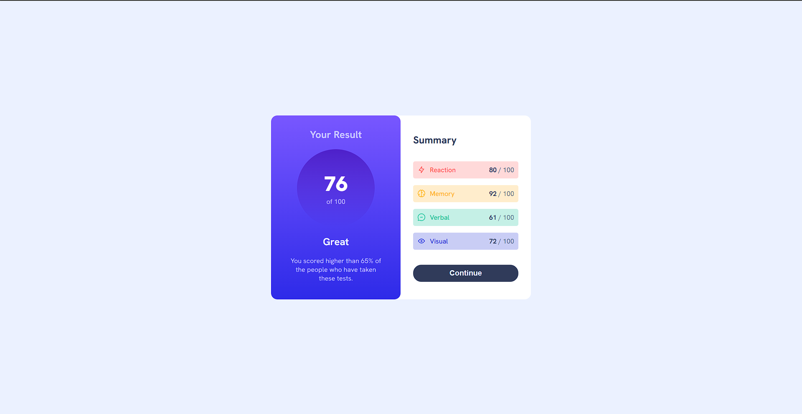

# Frontend Mentor - Results summary component solution

This is a solution to the [Results summary component challenge on Frontend Mentor](https://www.frontendmentor.io/challenges/results-summary-component-CE_K6s0maV). 

### Screenshot

### Links

- Solution URL: [here](https://www.frontendmentor.io/solutions/time-tracking-dashboard-solution-C3TGjLe1sl)
- Live Site URL: [here](https://sunilbaghel002.github.io/time-tracking-dashboard/)

## My process

### Built with

- Semantic HTML5 markup
- CSS custom properties
- CSS Variables
- CSS flexbox
- CSS Media Queries
- CSS Animation
- Basic JS
- DOM multiplation

# 🚀🚀🚀